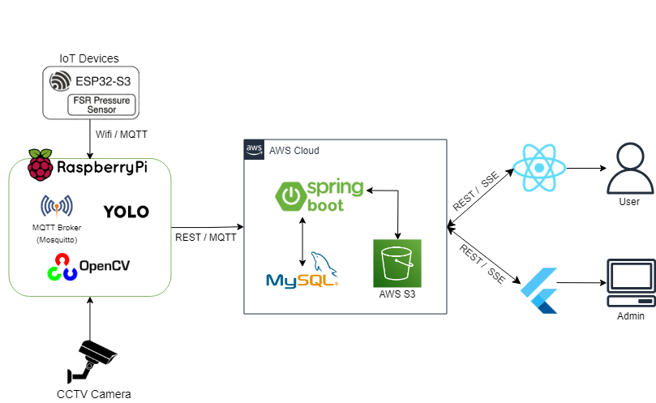

# AIoT 기반 스마트 좌석 헬스케어 및 사석화 방지 시스템

> 도서관/스터디카페의 사석화 방지와 실시간 헬스케어를 위한 지능형 좌석 모니터링 시스템

ESP32 3채널 압력 센서 기반 자세 판별, Raspberry Pi 5 엣지 AI(YOLO), Spring Boot 백엔드, React 관리자 웹, Flutter 학생 앱으로 구성된 풀스택 IoT 프로젝트입니다.

<br>

## 시스템 아키텍처



<br>

## 주요 기능

| 기능 | 설명 |
|------|------|
| 실시간 자세 판별 | FSR 압력 센서 3개(좌/우/등받이)로 다리 꼬기·거북목 등 자세 분석 |
| 사석화 자동 감지 | 체크인 상태에서 일정 시간 이상 공석 지속 시 사석화 확정 및 경고 |
| 분실물 AI 탐지 | YOLO v8 모델로 CCTV 영상에서 분실물 탐지 후 S3 업로드 |
| 전력 최적화 | 비교기(DM2794) 하드웨어 인터럽트로 ESP32 딥슬립 관리 |
| 관리자 대시보드 | 실시간 좌석 현황, 경고 이력, 분실물, 시스템 상태 모니터링 |

<br>

## 프로젝트 구성

```
Ejo/
├── app/                        # Flutter 학생 앱
├── library-admin-dashboard/    # React/Vite 관리자 웹
├── library-admin-backend/      # Spring Boot 공용 API 서버
└── iot/                        # Raspberry Pi 5 엣지 서버 + ESP32 펌웨어
```

<br>

## 기술 스택

| 분류 | 기술 |
|------|------|
| AI / Vision | Python 3.11, YOLOv8 (Ultralytics), OpenCV |
| Hardware / Edge | Raspberry Pi 5, ESP32, FSR 압력 센서, Tapo C200 IP 카메라 |
| Backend / Cloud | Spring Boot 3.3.5 (Java 17), MySQL, AWS EC2, AWS S3 |
| Frontend | React 18 / Vite, Flutter 3 / Dart |
| 통신 | MQTT (Eclipse Mosquitto), REST API |

<br>

---

## 1. Flutter 학생 앱 (`app/`)

도서관 좌석 예약, 실시간 헬스케어 모니터링, 경고 알림, 분실물 확인을 위한 Flutter 학생용 앱입니다.

### 요구사항
- Flutter SDK 3.11.4 이상
- 실행 중인 백엔드 서버

### 실행

```bash
cd app
flutter pub get
flutter run

# 백엔드 주소가 localhost가 아닌 경우
flutter run --dart-define=API_BASE_URL=http://your-server:8080/api/app

# Android 에뮬레이터에서 로컬 백엔드 접속 시
flutter run --dart-define=API_BASE_URL=http://10.0.2.2:8080/api/app
```

### 빌드

```bash
# Android APK
flutter build apk --dart-define=API_BASE_URL=http://your-server:8080/api/app
```

### 화면 구성

| 화면 | 설명 |
|------|------|
| 로그인 | 이메일/비밀번호 입력, 회원가입 이동 |
| 좌석 선택 | 전체 좌석 현황 그리드, 빈 좌석 선택·예약 |
| 나의 자리 | 예약한 좌석 정보, 압력 센서 헬스케어 요약 |
| 경고 알림 | 사석화·자세 경고 이력 |
| 분실물 리포트 | 탐지된 분실물 목록 및 이미지 |
| 앱 설정 | 알림·경고 기준 등 개인 설정 |

### 주요 의존성

| 패키지 | 버전 | 용도 |
|--------|------|------|
| `http` | ^1.5.0 | REST API 통신 |
| `intl` | ^0.20.2 | 날짜/시간 포맷 |

백엔드 주소는 `lib/config/api_config.dart`에서 `API_BASE_URL` 환경 변수로 설정합니다. 기본값: `http://localhost:8080/api/app`

<br>

---

## 2. Spring Boot 백엔드 (`library-admin-backend/`)

관리자 대시보드와 Flutter 학생 앱이 공통으로 사용하는 API 서버입니다.

### 요구사항
- Java 17, Maven 3.6 이상
- MySQL 8 (prod) 또는 인메모리 더미 데이터 (local 기본값)

### 실행

```bash
cd library-admin-backend

# 로컬 개발 (DB 없이 인메모리 데이터로 실행)
mvn spring-boot:run

# 로컬 MySQL 연동
export JDBC_DATABASE_USERNAME=library_user
export JDBC_DATABASE_PASSWORD=your_password
mvn spring-boot:run -Dspring-boot.run.profiles=local

# 프로덕션
export SPRING_PROFILES_ACTIVE=prod
export DB_HOST=your-rds-host && export DB_NAME=library_db
export DB_USERNAME=your_db_user && export DB_PASSWORD=your_db_password
export ADMIN_USERNAME=your_admin_id && export ADMIN_PASSWORD=your_admin_password
java -jar target/library-admin-backend-*.jar
```

### 빌드

```bash
mvn clean package -DskipTests
```

### 기본 정보

- 포트: `8080` / Base URL: `http://localhost:8080/api`

### API 목록

**인증**

| 메서드 | 경로 | 설명 |
|--------|------|------|
| POST | `/api/auth/login` | 관리자 로그인 |

**학생 앱 API** (헤더: `X-Student-Token: <token>`)

| 메서드 | 경로 | 설명 |
|--------|------|------|
| POST | `/api/app/auth/login` | 학생 로그인 |
| POST | `/api/app/auth/signup` | 학생 회원가입 |
| GET | `/api/app/me` | 내 정보 조회 |
| GET | `/api/app/seats` | 전체 좌석 현황 |
| POST | `/api/app/seats/{seatId}/selection` | 좌석 선택/해제 |
| GET | `/api/app/me/seat` | 내 좌석 정보 |
| GET | `/api/app/me/warnings` | 경고 이력 |
| GET | `/api/app/lost-items` | 분실물 목록 |

**관리자 대시보드 API**

| 메서드 | 경로 | 설명 |
|--------|------|------|
| GET | `/api/dashboard/overview` | 대시보드 개요 |
| GET | `/api/dashboard/stats` | 통계 |
| GET | `/api/dashboard/seats/zone-3` | 좌석 현황 |
| GET | `/api/dashboard/seats/abnormal` | 비정상 좌석 목록 |
| GET | `/api/dashboard/alerts/history` | 경고 이력 |
| POST | `/api/dashboard/actions/warning` | 경고 발송 |
| POST | `/api/dashboard/actions/release` | 강제 퇴실 |
| GET | `/api/dashboard/lost-items` | 분실물 목록 |
| GET | `/api/dashboard/system-status` | 시스템 상태 |

### 환경 변수

| 변수 | 설명 | 기본값 |
|------|------|--------|
| `ADMIN_USERNAME` | 관리자 아이디 | `admin` |
| `ADMIN_PASSWORD` | 관리자 비밀번호 | 프로덕션에서 반드시 설정 |
| `SPRING_PROFILES_ACTIVE` | 프로필 (`local` / `prod`) | `local` |
| `JDBC_DATABASE_PASSWORD` | DB 비밀번호 (local) | — |
| `DB_HOST` / `DB_NAME` / `DB_USERNAME` / `DB_PASSWORD` | DB 접속 정보 (prod) | — |
| `AWS_REGION` / `AWS_S3_BUCKET` / `AWS_ACCESS_KEY_ID` / `AWS_SECRET_ACCESS_KEY` | AWS 설정 (prod) | — |
| `MQTT_BROKER_URL` | MQTT 브로커 주소 | `tcp://localhost:1883` |

<br>

---

## 3. React 관리자 웹 (`library-admin-dashboard/`)

좌석 현황, 경고 이력, 분실물, 시스템 상태를 모니터링하는 관리자 웹 대시보드입니다.

### 요구사항
- Node.js 18 이상, npm 9 이상

### 실행

```bash
cd library-admin-dashboard
npm install
npm run dev
# 기본 포트: 5173
```

### 환경 변수

`.env.example`을 복사해 `.env`를 만들고 백엔드 주소를 설정합니다.

```bash
VITE_API_BASE_URL=http://localhost:8080
```

### 빌드

```bash
npm run build
# 결과물: dist/
```

### AWS Amplify 배포

루트의 `amplify.yml`을 사용합니다. Amplify 콘솔에서 환경 변수 설정:

```
VITE_API_BASE_URL=https://your-api-domain
```

> Amplify 기본 도메인은 HTTPS입니다. 백엔드가 HTTP면 Mixed Content 오류가 발생하므로 백엔드에도 HTTPS(ALB + ACM 인증서 또는 Nginx 리버스 프록시)를 적용해야 합니다.

<br>

---

## 4. IoT 엣지 컴퓨팅 (`iot/`)

Raspberry Pi 5 엣지 서버와 ESP32 센서 펌웨어입니다.

- `main_system.py` — 다중 좌석 관리, YOLO 분실물 탐지, S3 업로드, MQTT 수신, 백엔드 연동
- `add_healthcare.ino` — ESP32 FSR 3채널 압력 센서 자세 판별 후 MQTT Publish
- `requirements.txt` — Python 의존성

### Raspberry Pi 5 실행

```bash
cd iot

# 1. 환경 변수 설정
cp .env.example .env
# .env 파일을 열어 RTSP_URL, 백엔드 주소, AWS 키 등 실제 값 입력

# 2. 패키지 설치
pip install -r requirements.txt

# 3. MQTT 브로커 확인
sudo systemctl status mosquitto

# 4. 실행
python3 main_system.py
```

> `requirements.txt`는 CUDA 13.x / PyTorch 기반입니다. GPU가 없는 환경에서는 `torch`, `torchvision`을 CPU 버전으로 교체하세요.

YOLO 모델 파일(`best_v5.pt`)은 `.gitignore`에 포함되어 있어 저장소에 없습니다. `iot/` 디렉토리에 직접 복사하세요.

### Mosquitto 설정 (`/etc/mosquitto/mosquitto.conf`)

```
listener 1883
allow_anonymous true
```

### ESP32 펌웨어 업로드

```bash
# 1. 자격증명 파일 생성
cp iot/secrets.h.example iot/secrets.h
# secrets.h 를 열어 WiFi SSID/비밀번호와 MQTT 브로커 IP(Raspberry Pi IP) 입력
```

- Arduino IDE에서 보드: `ESP32 Dev Module` 선택
- `add_healthcare.ino` 상단 `#define SEAT_NUM 2`를 해당 좌석 번호로 변경 후 업로드

### IoT 환경 변수 (`iot/.env`)

| 변수 | 설명 |
|------|------|
| `RTSP_URL` | IP 카메라 RTSP 주소 |
| `IOT_BACKEND_BASE_URL` | 백엔드 API 주소 |
| `MQTT_BROKER` | MQTT 브로커 호스트 |
| `MQTT_PORT` | MQTT 브로커 포트 (기본: 1883) |
| `IOT_API_KEY` | IoT 어드민 HTTP 서버 인증 키 |
| `AWS_ACCESS_KEY` / `AWS_SECRET_KEY` / `AWS_S3_BUCKET` | AWS S3 설정 |

전체 목록은 `iot/.env.example` 참고.

### 핵심 로직

- **사석화 감지**: 체크인 상태에서 FSR 압력 0이 지속되면 타이머 후 사석화 확정 → 백엔드 알림
- **자세 판별**: 좌/우 압력 차 > 1000 이면 다리 꼬기, 등받이 압력 < 500 이면 거북목
- **분실물 탐지**: 관리자 트리거 수신 시 YOLO 실행 → S3 업로드 → 백엔드 전송
- **딥슬립**: 착석 감지 시에만 ESP32 기상, 미착석 시 `ext0` 인터럽트 대기

<br>

---

## 전체 실행 순서

```bash
# 1. 백엔드
cd library-admin-backend && mvn spring-boot:run

# 2. 관리자 웹 (별도 터미널)
cd library-admin-dashboard && npm install && npm run dev

# 3. 학생 앱 (별도 터미널)
cd app && flutter pub get && flutter run

# 4. IoT 엣지 서버 (Raspberry Pi)
cd iot && python3 main_system.py
```

또는 루트의 `Makefile` 활용:

```bash
make check-env      # 환경 확인
make backend-dev    # 백엔드 실행
make web-dev        # 관리자 웹 실행
make app-run        # Flutter 앱 실행
```

<br>

## 프로덕션 필수 환경 변수

| 변수 | 위치 | 설명 |
|------|------|------|
| `ADMIN_USERNAME` / `ADMIN_PASSWORD` | 백엔드 서버 | 관리자 계정 |
| `DB_HOST` / `DB_USERNAME` / `DB_PASSWORD` | 백엔드 서버 | MySQL 접속 정보 |
| `AWS_ACCESS_KEY_ID` / `AWS_SECRET_ACCESS_KEY` | 백엔드 서버 | S3 자격증명 |
| `VITE_API_BASE_URL` | 관리자 웹 `.env` | 백엔드 주소 |
| `RTSP_URL` | `iot/.env` | IP 카메라 주소 |
| `API_BASE_URL` | Flutter 빌드 옵션 | 백엔드 주소 |

<br>

## Git 커밋 규칙

| 태그 | 설명 |
|------|------|
| `feat` | 새로운 기능 추가 |
| `fix` | 버그 수정 |
| `design` | UI 디자인 수정 |
| `docs` | 문서 수정 |
| `refactor` | 코드 리팩토링 |
| `chore` | 빌드, 설정, `.gitignore` 수정 |
| `test` | 테스트 코드 |

## 브랜치 전략

- `main`: 최종 배포용
- `develop`: 개발 통합
- `feature/기능명`: 기능별 개발
